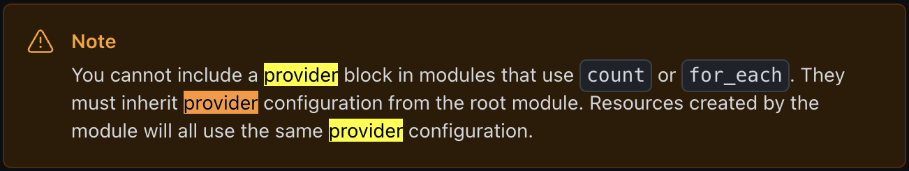

# Terraform

## Install

```bash
brew tap hashicorp/tap
brew install hashicorp/tap/terraform
```

### Auto-completion

```bash
terraform -install-autocomplete
```

### IDE

syntax highlighting 없으면 타자를 못침

- VSCode: https://marketplace.visualstudio.com/items?itemName=HashiCorp.terraform

- vim: lvim 쓰면 알아서 해줌 (terraform-ls 란 language server 사용하는듯)


## gogo

- Getting Started 보면서 냅다 시작

### Docker

```hcl
terraform {
  required_providers {
    docker = {
      source  = "kreuzwerker/docker"
      version = "~> 3.0.1"
    }
  }
}

provider "docker" {}

resource "docker_image" "nginx" {
  name         = "nginx"
  keep_locally = false
}

resource "docker_container" "nginx" {
  image = docker_image.nginx.image_id
  name  = "tutorial"

  ports {
    internal = 80
    external = 8000
  }
}

```

- `terraform init` 을 하면 `docker` provider 를 다운로드 받음
> .terraform/providers/registry.terraform.io/kreuzwerker/docker/3.0.2/darwin_arm64/terraform-provider-docker_v3.0.2 -> 이게 맞냐?
- `terraform apply` 하면 실행된.. 다고 했는데 안되는데? 
  - 도커 실행중 맞는데?
  - 
  - 언젠가 내가 docker context 를 바꿔뒀나봄. unix socket 위치 잡아줘서 해결. (provider "docker" { host = "unix:///path/to/socket" } )
  - 암튼 실행해보니 잘됨
- `terraform destroy` 하면 삭제됨

### AWS EC2

```terraform
terraform {
  required_providers {
    aws = {
      source  = "hashicorp/aws"
      version = "~> 4.16"
    }
  }

  required_version = ">= 1.2.0"
}

provider "aws" {
  region  = "us-west-2"
}

resource "aws_instance" "app_server" {
  ami           = "ami-830c94e3"
  instance_type = "t2.micro"

  tags = {
    Name = "ExampleAppServerInstance"
  }
}
```

- terraform init
- terraform fmt - formatting
- terraform validate - syntax check
- terraform apply
  - 일단 만들어주긴 함. 
  - 지맘대로 설정을 잡긴 하는데 다 납득할만한듯? (왜 ubuntu?)
- 다중 리전으로 해보고 싶어서 냅다 region 을 array 로 넣었는데 실패했다.
```terraform
provider "aws" {
  region = "us-west-1"
  alias  = "usw1"
}

provider "aws" {
  region = "us-east-1"
  alias  = "use1"
}

resource "aws_instance" "ec2_us_west_1" {
  provider = aws.usw1
  // other configuration...
  instance_type = "t2.micro"

  tags = {
    Name = "ExampleAppServerInstance"
  }
}

resource "aws_instance" "ec2_us_east_1" {
  provider = aws.use1
  // other configuration...
  instance_type = "t2.micro"

  tags = {
    Name = "ExampleAppServerInstance"
  }
}
```
이것도 실패했다. AMI (Amazon machine image) 라는 값이 있는데, 얘가 regional 하게 unique 란다. 얼탱

cdk 는 될거 같은데 쩝... terraform 도 그리 아름답진 않은듯

- 각 모듈별로 tf 파일을 나눠서 multiple-region deploy
- makefile 같은거 쓰는건 어떨지? -> 리소스 관리할때 그리 아름답지 않을 것 같음.  

```terraform
├── main.tf
├── modules
│   └── ec2_instance
│       ├── main.tf
│       ├── outputs.tf
│       └── variables.tf
└── terraform.tfstate
```

- 이런식으로 하면 된다. 
- 근데 VPC 다 따로 잡아줘야 한다. 생각 못했는데 생각해보면 당연함.ㅔ
- 너무 코드가 더러워지는데? 근본적으로 provider 정의가 너무 겹친다. for_each 공부해야할듯
  - 안된다고 한다! [reference](https://developer.hashicorp.com/terraform/tutorials/configuration-language/for-each)  
  - 오랫동안 이어진 이슈도 있다. https://github.com/hashicorp/terraform/issues/24476
- 걍 타협하고 여러번 정의함... 스크립트 짜야할듯

